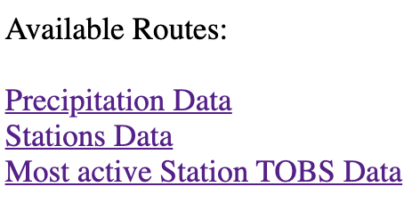

# Developed a live API using Python and SqLite data file.
* SqLite file contains Weather Station data.
  * 'Measurement' class : Station name, date, precipitation (prcp), and temperature (tobs). 
  * 'Station' class : Station number, Station name, latitude, longitude, and elevation.

### Working with the data
* Load SqLite file into Python Notebook and identify classes and reflect into SqlAlchemy.
* Assign 'measurement' and 'station" to variable called 'Measurement' and 'Station'
* Create a Session, from the 'Measurement' class query columns listed above. From the 'Station' class, query columns listed above as well.
* Analyze the data. How many stations are there? What is the most active station? 

### Visualizing the data : [Python Notebook Link](https://github.com/hedeencharles/PythonAPI_SqlAlchemy_Project/blob/master/JupyterNotebook/Read_data.ipynb)
* Design a query to retrieve the last 12 months of prcp data and graph. 

* Design queries to get an idea of the temperature distribution and trends. Generate a box and whisker to visualize the upper and lower bounds. Generate a histogram to visualize the temperature distribution. 

### Develop a live API using Flask : [Flask App Link](https://github.com/hedeencharles/PythonAPI_SqlAlchemy_Project/blob/master/JupyterNotebook/app.py)
* Develop a live API using Flask that will display given data from SqLite file.
* Three available API's:
 

* To run Flask app, all dependencies must be installed locally (using pip for example), and python app run from the terminal. 

  